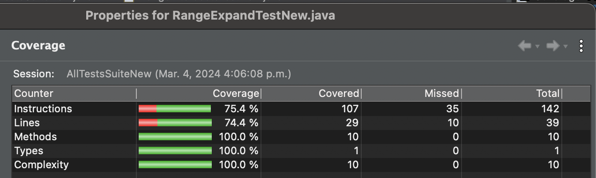
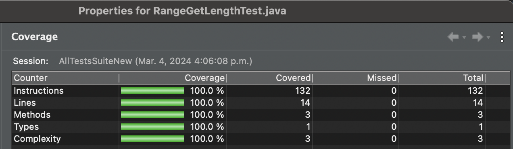
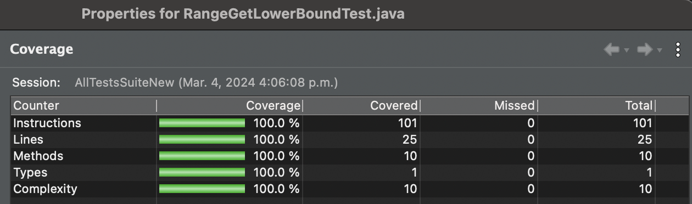
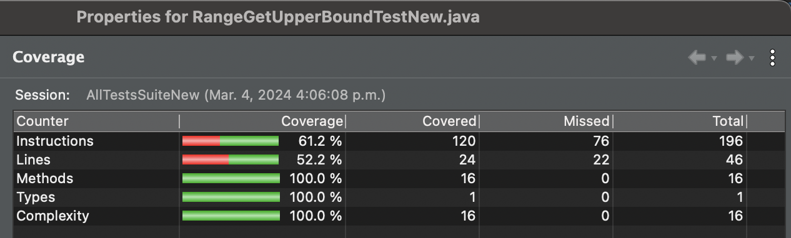
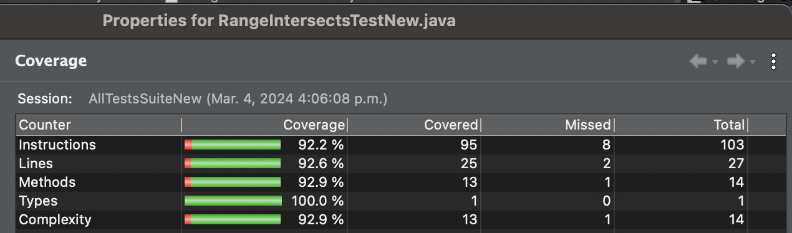

**SENG 438 - Software Testing, Reliability, and Quality**

**Lab. Report #3 – Code Coverage, Adequacy Criteria and Test Case Correlation**

| Group: 16           |
| ------------------- |
| Luke Ens            |
| Chinonso Oragwam    |
| Marcos Perez Perera |
| Ibrahim Wani        |

(Note that some labs require individual reports while others require one report
for each group. Please see each lab document for details.)

# 1 Introduction

In this assignment, we bolstered our JUnit test suite by moving onto white box testing by:
1. Assessed the coverage of previous tests.
2. Reassessed test strategies.
3. Improved the test suite. 

This lab report compiles our unit testing strategies and the test cases that followed, including their results. 

# 2 Manual data-flow coverage calculations for X and Y methods

Text…

# 3 A detailed description of the testing strategy for the new unit test

Text…

# 4 A high level description of five selected test cases you have designed using coverage information, and how they have increased code coverage

Text…

# 5 A detailed report of the coverage achieved of each class and method 
(a screen shot from the code cover results in green and red color would suffice)

## Data Utilites

### Calculate Column Total

### Calculate Row Total

### Create Number Array

### Create Number Array 2D

### Get Cumulative Percentages

## Range

### Expand

### Get Length

### Get Lower Bound 

### Get Upper Bound

### Intersects

# 6 Pros and Cons of coverage tools used and Metrics you report

Text…

# 7 A comparison on the advantages and disadvantages of requirements-based test generation and coverage-based test generation.

Lets write down a big list of items:

### Requirements-based Testing
Advantages:
- Ensures software adheres to specifications
- Tests focus on regularly used features

Disadvantages:
- Requires clear, unchanging documentation
- Not good at catching edge cases
- Resource intensive, especially for complex systems

### Coverage-based Testing
Advantages:
- Provides quantitative metrics for analysing code
- Easily automated

Disadvantages:
- Doesn't focus on program's requirements
- Not good at catching complicated errors 
- Can create false sense of "completeness"

# 8 A discussion on how the team work/effort was divided and managed

Text…

# 9 Any difficulties encountered, challenges overcome, and lessons learned from performing the lab

Text…

# 10 Comments/feedback on the lab itself

Text…
