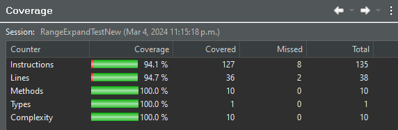

**SENG 438 - Software Testing, Reliability, and Quality**

**Lab. Report #3 – Code Coverage, Adequacy Criteria and Test Case Correlation**

| Group: 16           |
| ------------------- |
| Luke Ens            |
| Chinonso Oragwam    |
| Marcos Perez Perera |
| Ibrahim Wani        |

(Note that some labs require individual reports while others require one report
for each group. Please see each lab document for details.)

# 1 Introduction

In this assignment, we bolstered our JUnit test suite by moving onto white box testing by:
1. Assessed the coverage of previous tests.
2. Reassessed test strategies.
3. Improved the test suite. 

This lab report compiles our unit testing strategies and the test cases that followed, including their results. 

# 2 Manual data-flow coverage calculations for X and Y methods

## Data Utilities Calculate Column Total

### Data Flow Graph:


**Def-Use Sets Per Statement**

To define the def-use sets per statement for the calculateColumnTotal method, we examine where each variable is defined and where it's used.

**data**: Defined as a parameter. **Used** in data.getRowCount() and data.getValue(row, column).

**column**: Defined as a parameter. **Used** in data.getValue(row, column).

**validRows**: Defined as a parameter. **Used** in the loop to get validRows\[v\].

**total**: Defined initially as 0.0, potentially redefined to 100 if total > 0 (which is never true given the initial definition), and updated within the loop with total += n.doubleValue().

**rowCount**: Defined with data.getRowCount(). Used in if (row < rowCount).

**v**: Defined at the beginning of the loop. **Used** to index validRows.

**row**: Defined as validRows\[v\]. **Used** in data.getValue(row, column).

**n**: Defined as data.getValue(row, column). **Used** in n != null and n.doubleValue().

**DU Pairs for calculateColumnTotal**

Given the definitions and uses above, the DU pairs for variables in calculateColumnTotal are:

**For total:**

*   (Definition of total, use in if (total > 0))
    
*   (Definition of total, use in total += n.doubleValue())
    
*   (Definition of total, return total)
    

**For rowCount:**

*   (Definition of rowCount, use in if (row < rowCount))
    

**For row:**

*   (Definition of row, use in data.getValue(row, column))
    

**For n:**

*   (Definition of n, use in total += n.doubleValue())

### Pairs Covered by Test Cases:

**DU Pairs Analysis FOR DATA UTILITIES**

**calculateColumnTotalForTwoPositiveValues**

**Covered DU Pairs:**

*   The definition of total at the start is used in total += n.doubleValue() for both mock values, covering (Definition of total, use in total += n.doubleValue()).
    
*   The definition of rowCount with data.getRowCount() is used in if (row < rowCount), covering (Definition of rowCount, use in if (row < rowCount)).
    
*   The definition of row in the loop is used in data.getValue(row, column), covering (Definition of row, use in data.getValue(row, column)).
    
*   The definition of n in the loop is used in total += n.doubleValue(), covering (Definition of n, use in total += n.doubleValue()).
    

**Not Covered Pairs**

*   The condition if (total > 0) is not covered because total starts from 0 and is only increased; it doesn't specifically test the path where total is initially greater than 0.
    
*   n as both null and non-null
    

**DU Coverage Calculation**


DU Pair Coverage = 4/6 = 0.6667 = 66.67 %

**calculateColumnTotalForThreeNegativeValues**

**Covered DU Pairs:**

**For total:**

*   The definition of total at the start is used in total += n.doubleValue() for all three mock values, covering: (Definition of total, use in total += n.doubleValue())
    
*   The return of total is covered, reflecting:
    

(Definition of total, return total)

**For rowCount:**

*   The definition of rowCount with data.getRowCount() is used in if (row < rowCount), covering:
    

(Definition of rowCount, use in if (row < rowCount))

**For row:**

*   The definition of row in the loop is used in data.getValue(row, column), covering:
    

(Definition of row, use in data.getValue(row, column))

**For n:**

*   The definition of n in the loop is used in total += n.doubleValue(), covering:
    

(Definition of n, use in total += n.doubleValue())

**Uncovered Pairs:**

*   The condition if (total > 0) is not covered because total starts from 0 and is only increased; it doesn't specifically test the path where total is initially greater than 
    
*   n as both null and non-null
    

DU Coverage Calculation


DU Pair Coverage = 4/6 = 0.6667 = 66.67 %

**calculateColumnTotalWithLargeIndex**

This test follows the same logic of retrieving and adding values for the above 2 tests and so has the same DU coverage calculation of the above tests of **66.67 %.** As well as the same covered Pairs and uncovered Pairs

**calculateColumnTotalWithNullValues**

**Covered DU Pairs in this Test Case:**

**For total:**

*   The definition of total is used in total += n.doubleValue() when n is not null. However, in this test, one of the values is null, which means the addition operation is skipped for this value. Despite this, the initial definition of total and its use in the addition (for the non-null value) and its return are covered.
    

**For rowCount:**

*   The definition of rowCount with data.getRowCount() is used in if (row < rowCount), which is covered since the loop is entered.
    

**For row:**

*   The definition of row in the loop is used in data.getValue(row, column), which is covered for both the non-null and null value cases.
    

**For n:**

*   The definition of n as null for one of the values and as non-null (7.5). The test case covers the use of n in the conditional check for null (if (n != null)) and the subsequent addition to the total for the non-null case.
    

DU Coverage Calculation


**2 (for total) + 1 (for rowCount) + 1 (for row) + 1 (for n) = 5 DU pairs covered out of 6 total DU pairs.**

DU Pair Coverage = 5/6 = 0.6667 = 83.33 %

**calculateColumnTotalWithNullAndNumericValues**

This test follows a similar logic to the above test where we test for null values and has the same DU coverage because we’re focusing on our functions capacity to handle null values. So the DU coverage is **83.33 %**

**calculateColumnTotalForEmptyMatrix**

**Covered DU Pairs**

**For total:**

*   The definition of total is not used in a modifying way (total += n.doubleValue() is never reached), but it is returned. (Definition of total, return total).
    

**For rowCount:**

*   The definition of rowCount does not lead to a use within the loop because the loop conditions are not met. However, its definition still occurs, so it's more about the lack of subsequent use due to the test case setup rather than not being covered.
    

**DU Coverage Calculation**


**1 (for total)** 

**DU Pair Coverage = 1/6 = 0.1667 = 16.67 %**

**calculateColumnTotalForOutOfBoundsIndexBelow andcalculateColumnTotalForOutOfBoundsIndexAbove**

**Covered DU Pairs by Both Test Cases**

total is defined at the start with double total = 0.0; and is returned at the end without being modified due to the exception thrown by values.getValue(0, column). Thus, the (Definition of total, return total) DU pair is covered.

rowCount is defined with int rowCount = data.getRowCount();, but since the loop's execution leads to an exception (as per the test setup), the use of rowCount in the condition if (row < rowCount) is not considered in these tests

**DU Coverage Calculation**


**1 (for total)** 

**DU Pair Coverage = 1/6 = 0.1667 = 16.67 %**

**Overall DU Pair Coverage of our Method:**
**\= 6/6 = 100%**
### DU-Pair Coverage:
```
du-pair coverage = (6 / 6) * 100 = ???%
```

## Range Expand

### Data Flow Graph:


| Data Flow  |  |
| -- | -- |
| defs: | def(1) = { range, lowerMargin, upperMargin } <br> def(2) = { length, lower, upper } |
| uses: | use(2) = { range, length, lowerMargin, upperMargin } <br> use(3) = { lower, upper } <br> use(4) = { lower, upper } |
| du-pairs: | for range (1,2) <br> for lowerMargin  (1,2) <br> for upperMargin  (1,2) <br> for length  (2,2) <br> for lower  (2,3) (2,4) <br> for upper  (2,3) (2,4) |

### Pairs Covered by Test Cases:

| Test Case | DU-Pairs Covered |
| -- | -- |
| all* | range (1,2) <br> lowerMargin  (1,2) <br> upperMargin  (1,2) <br> length  (2,2) |
| expand_WithValidPositiveMargins_ShouldExpandRangeProperly | lower  (2,4) <br> upper  (2,4) |
| expand_WithZeroMargins_ShouldNotChangeRange | lower  (2,4) <br> upper  (2,4) |
| expand_WithNegativeMargins_ShouldThrowError | lower  (2,3) (2,4) <br> upper  (2,3) (2,4) |
| expand_MinimalPositiveMargins_ShouldSlightlyExpandRange | lower  (2,4) <br> upper  (2,4) |
| expand_LargePositiveMargins_ShouldSignificantlyExpandRange | lower  (2,4) <br> upper  (2,4) |
| expand_OneMarginZeroAndOneMarginNonZero_ShouldExpandRange | lower  (2,4) <br> upper  (2,4) |
| expand_BothMarginsZero_ShouldNotChangeRange | lower  (2,4) <br> upper  (2,4) |

### DU-Pair Coverage:
```
du-pair coverage = (8 / 8) * 100 = 100%
```

# 3 A detailed description of the testing strategy for the new unit test
The tests we had created in assignment 2 for our Data Utilities class had high coverage for most metrics except the GetCumulativePercentagesTests where we had low coverage across all metrics due to a change in the JfreeChart code. Our testing strategy centred around improving this to meet the coverage criteria and it was done by updating the expected invocations in our mock objects from 2 (n + 1) to 2(n + 1) + 1 to match our code base. Our strategy when trying to write new tests to improve code coverage was to look at the source code and compare it to our already written tests to find areas of improvement. For example, we examined the calculateRowTotal method for data utilities and found that we could improve line coverage by adding a test with all null values which would cover the path scenario where all our rows are null. To make our strategy of analyzing the source code of the methods more effective we drew sketches of control flow graphs and walked through several test cases to see which nodes and edges could potentially be covered with the addition of new test cases.


# 4 A high level description of five selected test cases you have designed using coverage information, and how they have increased code coverage

**calculateRowTotalWithAllNullValues** - Improved line coverage by 1% by adding a check for all null values 

**getCumulativePercentagesForLargeData** - Improved branch coverage by 5% by updating the expected invocations to match the JFreeChart method, updated from 2*numRows + 1 to 2*(numOfRows+1) + 1

**getCumulativePercentagesWithNullEntries** - Improved branch coverage by updating the expected invocations to match the JFreeChart method, as well as adding additional null entries

**Range Get Upper Bound**

*   Upon looking at the method and seeing an exception not stated by the documentation, we added a test for IllegalArgumentException. This helped increase the path coverage for a path we were previously unaware of. 
    

**Range Expand**

*   Based on the coverage and examining the method, we ensured a test was included that had negative parameters, to reach the situation where the range would collapse on itself and become an averaged point. This increased the path coverage by testing functionality we were previously unaware of. 
    

**Range Intersects**

*   Examining the paths inside the method, we decided to add a test with reversed arguments, to cover a path where the upper is lower than the lower bound. Examining the path coverage revealed more paths than expected, including this one which helped to increase the code coverage.


# 5 A detailed report of the coverage achieved of each class and method 
(a screen shot from the code cover results in green and red color would suffice)

## Data Utilites

### Calculate Column Total


### Calculate Row Total


### Create Number Array


### Create Number Array 2D


### Get Cumulative Percentages


## Range

### Expand


### Get Length


### Get Lower Bound 


### Get Upper Bound


### Intersects


# 6 Pros and Cons of coverage tools used and Metrics you report

### Coverage Tool Used: EclEmma

Pros:
- Code Coverage: EclEmma provides detailed code coverage analysis, albeit missing some metrics, showing which parts of the code are being exercised by the tests.
- Integration with IDE: EclEmma is already installed and integrated into the Eclipse IDE, making it useful to incorporate into the workflow

Cons:
- Specific Analysis Limitations: EclEmma primarily focuses on runtime code coverage analysis and does not provide insights into some areas of the code that are not exercised during testing, such as error handling or edge cases.
- Missing metrics: EclEmma could be more helpful with providing specific insights or tips to help further improve test code.

# 7 A comparison on the advantages and disadvantages of requirements-based test generation and coverage-based test generation.

Lets write down a big list of items:

### Requirements-based Testing
Advantages:
- Ensures software adheres to specifications
- Tests focus on regularly used features

Disadvantages:
- Requires clear, unchanging documentation
- Not good at catching edge cases
- Resource intensive, especially for complex systems

### Coverage-based Testing
Advantages:
- Provides quantitative metrics for analysing code
- Easily automated

Disadvantages:
- Doesn't focus on program's requirements
- Not good at catching complicated errors 
- Can create false sense of "completeness"

# 8 A discussion on how the team work/effort was divided and managed

Text…

# 9 Any difficulties encountered, challenges overcome, and lessons learned from performing the lab

Text…

# 10 Comments/feedback on the lab itself

Text…
